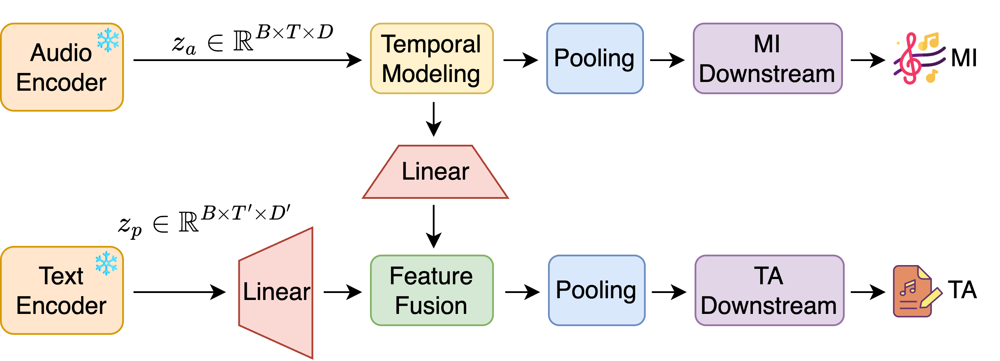

# [Repository in progress.] ASTAR-NTU Solution to AudioMOS Challenge 2025 Track 1

This repository contains the official implementation of the ASTAR-NTU solution for Track 1 AudioMOS Challenge 2025.

Our approach utilizes a dual-branch architecture leveraging frozen pre-trained audio and text encoders, combined with specialized temporal modeling and cross-modal attention mechanisms.

For detailed information, please refer to our paper: [ASTAR-NTU solution to AudioMOS Challenge 2025 Track1](https://arxiv.org/pdf/2507.09904).

## Model Architecture

We propose a dual-branch architecture designed to predict Music Integrity (MI) and Text Alignment (TA) scores simultaneously.


*Figure 1: Proposed dual-branch architecture for MI and TA prediction.*

1.  **Encoders:** We utilize a frozen audio encoder (MuQ) and a frozen text encoder (RoBERTa) to extract rich features ($z_a$ and $z_p$). Both encoders are frozen.
2.  **MI Branch (Top):** The audio features undergo Temporal Modeling (Transformer encoder layers) followed by Pooling (attentive pooling). This representation is passed to the MI Downstream head (MLP or LSTM) to predict the music impression score.
3.  **TA Branch (Bottom):** Audio and text features are projected to a common embedding space (Linear). A cross-attention mechanism (Feature Fusion) allows the text representation to attend to the audio representation. The fused features are pooled and passed to the TA Downstream head to predict the text alignment score.

Our best models employ distribution prediction (optimized via KL-Divergence loss with Gaussian-smoothed targets) or ordinal regression (CORAL loss).

## Setup and Installation

### Prerequisites

  * Linux environment
  * Python 3.8+
  * PyTorch (tested with 1.12+)
  * CUDA-enabled GPU recommended for training

### Installation

1.  Install required packages.

    ```bash
    pip install -r requirements.txt
    ```


## Data Preparation

1.  Download the AudioMOS Challenge 2025 Track 1 dataset (MusicEval-phase1).

2.  Organize the dataset directory structure as follows:

    ```
    MusicEval-phase1/
    ├── wav/
    │   └── ... (audio files)
    └── sets/
        ├── train_mos_list.txt
        └── dev_mos_list.txt
    ```

    The list files (`.txt`) must be in the format: `filename,overall_score,textual_score`.

## Reproducing the Results

The final submission is an ensemble of 8 models trained with variations in architecture, loss function, and random seeds.

### Training the Full Ensemble

To reproduce the training for all models required for the ensemble, use the `run_experiments.sh` script.

**Important:** Before running the script, you must modify the `DATA_DIR` variable inside `run_experiments.sh` to point to your local MusicEval-phase1 dataset directory.

```bash
# Edit DATA_DIR in run_experiments.sh first
# Then run the experiments
bash run_experiments.sh
```

### Training the Primary Model (Example)

To train the best single model (`muq_roberta_transformer_dist` with Gaussian targets) individually:

```bash
python train.py \
    --expname primary_model_gaussian \
    --model_type muq_roberta_transformer_dist \
    --datadir /path/to/MusicEval-phase1 \
    --train_list_path /path/to/MusicEval-phase1/sets/train_mos_list.txt \
    --validation_list_path /path/to/MusicEval-phase1/sets/dev_mos_list.txt \
    --test_list_path /path/to/MusicEval-phase1/sets/dev_mos_list.txt \
    --batch_size 32 \
    --lr 5e-5 \
    --optimizer adamw \
    --dist_prediction_score_style gaussian \
    --num_bins 20
```

## Evaluation and Ensembling

During training, the `train.py` script saves checkpoints based on validation performance. After training finishes, it evaluates the best checkpoint on the test set (`--test_list_path`).

Crucially, the evaluation phase saves detailed prediction files (in `.pt` format) within the experiment directory under the `model_predictions_for_ensemble/` subfolder. These files contain the scores and predicted distributions for each sample.

To generate the final submission, the outputs from the 8 models must be combined. This requires loading the detailed prediction files (.pt) from each experiment and performing an ensemble, you may look at prepare_predict_files_ensemble.sh.

## Citation

If you use this codebase or find our approach useful in your research, please cite our paper:

```bibtex
@article{ritter2025astar,
  title={ASTAR-NTU solution to AudioMOS Challenge 2025 Track1},
  author={Ritter-Gutierrez, Fabian and Lin, Yi-Cheng and Wei, Jui-Chiang and Wong, Jeremy HM and Chen, Nancy F and Lee, Hung-yi},
  journal={arXiv preprint arXiv:2507.09904},
  year={2025}
}
```